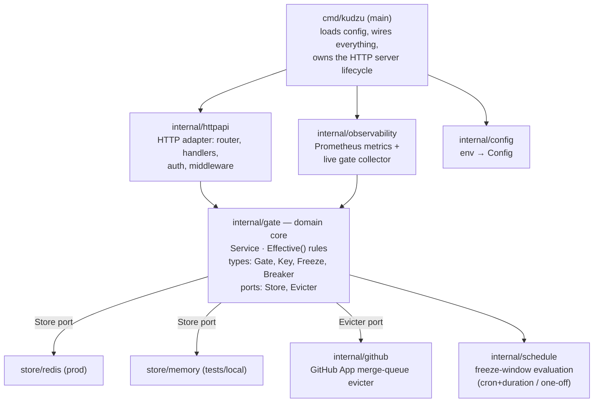
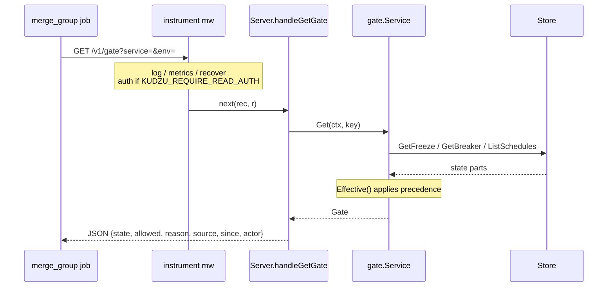

# Kudzu — Application Structure

This document explains how Kudzu is laid out: what each package is responsible
for, what lives in each file, and how a request flows through the system. It is a
companion to the user-facing [`README.md`](../README.md) (which covers behaviour,
the API, and operations) — here the focus is the **code**.

## 1. What the app is

Kudzu is a small, stateless Go service that answers one question: **"is it safe
to deploy `<service>` to `<environment>` right now?"** A gate is keyed by
`(service, env)` and resolves to one effective state:

```
tripped  >  manual freeze  >  scheduled freeze  >  open
```

(precedence high → low). A GitHub Actions `merge_group` job reads `.allowed` and
ejects PRs from the merge queue when the gate is not open. A tripped circuit
breaker can additionally call back into GitHub to evict in-flight merge groups
immediately.

## 2. Design shape (ports & adapters)

The code follows a hexagonal / "ports and adapters" layout. The domain
(`internal/gate`) sits in the centre and **defines the interfaces it needs**;
the outer packages implement them. All dependency arrows point inward.



Why this matters in practice:

- `internal/gate` imports **no** infrastructure. It depends only on
  `internal/schedule` and the standard library.
- The `Store` and `Evicter` interfaces are declared in `gate` (where they are
  *consumed*), not in the packages that implement them. Swapping Redis for the
  in-memory store, or disabling eviction, is just choosing a different
  implementation at wire-up time in `main`.

## 3. Directory map

```
cmd/kudzu/                 service entrypoint (config load, wiring, graceful shutdown)
internal/
  gate/                    domain: state model, effective-state rules, Service, ports
  schedule/                freeze-window evaluation (cron+duration / one-off interval)
  store/
    redis/                 gate.Store on Redis (production)
    memory/                gate.Store in memory (tests / local single-replica)
  github/                  gate.Evicter via a GitHub App (merge-queue eviction)
  httpapi/                 router, handlers, bearer auth, logging/metrics/recovery mw
  observability/           Prometheus registry, HTTP instruments, live gate collector
  config/                  load Config from environment variables
deploy/                    Dockerfile + Helm chart
github/                    composite "Kudzu Gate" action + example workflows
docker-compose.yml         local Kudzu + Redis stack
Makefile                   build / test / run / docker targets
```

## 4. File-by-file

### `cmd/kudzu/main.go` — entrypoint & composition root
The only place where concrete implementations are chosen and wired together.

- `main()` sets up the JSON `slog` logger and calls `run()`.
- `run()` is the composition root, in order:
  1. `config.Load()` — read environment; warn if no write tokens.
  2. Build the go-redis client and **ping it** (fail fast if Redis is
     unreachable).
  3. Pick the evicter: a real `github.Client` if GitHub App creds are present
     (`cfg.EvictionEnabled()`), otherwise `gate.NoopEvicter{}`.
  4. Construct `gate.NewService(redisstore.New(rdb), evicter, cfg, log)`.
  5. Build `observability.New(svc, …)` and `httpapi.NewRouter(…)`.
  6. Start `http.Server` with sane timeouts; handle `SIGINT`/`SIGTERM` for
     graceful shutdown (15s drain).

### `internal/gate/` — the domain core

**`gate.go`** — types, ports, and the pure rules.
- Enums: `State` (`open` / `frozen` / `tripped`) and `Source` (`manual` /
  `schedule` / `breaker`).
- `Key{Service, Env}` — the gate identity (`valid()` requires both set).
- `Gate` — the computed view returned to callers (`state`, `allowed`, `reason`,
  `source`, `since`, `actor`).
- `Freeze` — a manual freeze record with optional `ExpiresAt`; `ActiveAt(now)` is
  nil-safe.
- `Breaker` — circuit-breaker state (`Tripped`, `Fails`, last SHA/run, etc.).
- `AuditEntry` — one recorded change; `DeployResult` — circuit-breaker input from
  a pipeline.
- **Ports:** `Store` (persistence) and `Evicter` (GitHub merge-queue eviction),
  plus `NoopEvicter`.
- `Effective(k, freeze, breaker, schedules, now) Gate` — the **pure function**
  that applies the precedence rules. No I/O; trivially unit-testable.

**`service.go`** — the business logic; the only thing handlers talk to.
- `Service` holds the `Store`, `Evicter`, `Config`, logger, plus injectable
  `now()` and `evictCtx()` (for tests).
- `NewService` applies defaults (`FailureThreshold` ≥ 1, `CheckContext` =
  `kudzu-gate`).
- Read methods: `Get` (load freeze+breaker+schedules, run `Effective`), `List`
  (fan out over `ListKeys`), `ListSchedules`, `Ping`.
- Write methods: `Freeze`, `Unfreeze` (clears freeze **and** resets the breaker),
  `RecordDeploy` (the breaker logic: count failures, trip at threshold, reset on
  success), `AddSchedule`/`DeleteSchedule`.
- `evict()` runs the GitHub eviction **off the request path** in a goroutine with
  its own timeout; failures are logged, not fatal (next gate poll is the
  backstop).
- `audit()` best-effort appends an `AuditEntry`.

**`service_test.go`** — behaviour tests for the service (breaker, freeze,
precedence, eviction wiring).

### `internal/schedule/` — freeze-window evaluation

**`schedule.go`** — pure window logic, no I/O.
- `Schedule` — either a one-off `[Start, End)` interval or a recurring
  `Cron`+`Duration` window.
- `Valid()` checks well-formedness (and that the cron parses).
- `IsActiveAt(now)` — for cron windows, walks back to the latest activation at/
  before `now` and checks whether its `Duration` still covers `now`.
- `ActiveWindow(schedules, now)` — returns the first active window.
- Uses `robfig/cron/v3` with the standard 5-field parser.

**`schedule_test.go`** — table tests for one-off and recurring windows.

### `internal/store/` — `gate.Store` implementations

**`redis/redis.go`** (production) — JSON-encodes each piece of state under
namespaced keys (`kudzu:freeze:…`, `kudzu:breaker:…`, `kudzu:sched:…`,
`kudzu:audit:…`). A Redis **set** (`kudzu:keys`) tracks known `(service,env)`
pairs so `ListKeys` can enumerate every gate. Schedules are a hash keyed by id;
audit is a capped list (`LPush` + `LTrim`, cap 100). `var _ gate.Store` asserts
the interface at compile time.

**`memory/memory.go`** (tests / local) — a mutex-guarded map-backed store with
the same semantics (audit capped at 100). State is lost on restart and not shared
across replicas — fine for tests and single-instance local runs.

### `internal/github/github.go` — `gate.Evicter`
Authenticates as a GitHub App installation (`bradleyfalzon/ghinstallation/v2`)
and, on a trip, lists `gh-readonly-queue/<base>/*` branches via the
`matching-refs` API and posts a `state=failure` commit status (context =
`CheckContext`) to each head SHA, so GitHub ejects those PRs. Per-branch failures
are logged and skipped, not fatal. `apiBase` is normalised so the same code works
against github.com and GHES (`/api/v3/`). **`github_test.go`** uses an httptest
server to verify the ref-listing + status-posting calls.

### `internal/httpapi/` — the HTTP adapter

**`router.go`** — `NewRouter(Options)` builds the `http.ServeMux` (Go 1.22+
method-aware patterns). Maps every route to a handler, wraps writes (and
optionally reads) in token auth, and wraps everything in the `instrument`
middleware. Defines `Options` and `DefaultReadTimeout`.

**`handlers.go`** — the `Server` type and one handler per endpoint. Declares the
`GateService` interface (the slice of `gate.Service` the HTTP layer needs — note
the dependency is again defined at the consumer). Holds JSON request DTOs
(`freezeReq`, `unfreezeReq`, `scheduleReq`) and the `decode`/`writeJSON`/
`writeError` helpers. `writeServiceErr` maps `gate.ErrInvalidKey` → 400, anything
else → 500.

**`auth.go`** — `tokenAuth`: constant-time (`crypto/subtle`) bearer-token check
over the configured token set. **Fail-closed**: with no tokens configured,
protected routes reject everything. `require()` wraps a handler.

**`middleware.go`** — `instrument()`: panic recovery, structured access logging
(health probes at debug), and metrics via the `observer` interface.
`statusRecorder` captures the response status. The `route` label is the static
pattern (not the concrete path) to keep metric cardinality bounded.

**`handlers_test.go`** — HTTP-level tests using a fake `GateService`.

### `internal/observability/metrics.go` — Prometheus
`Metrics` owns a private registry with Go/process collectors plus:
- `kudzu_http_requests_total{method,route,status}` (status bucketed to
  `2xx/3xx/4xx/5xx`) and `kudzu_http_request_duration_seconds{method,route}` —
  fed by `Observe()` from the middleware.
- a custom `gateCollector` that, **on each scrape**, calls `Service.List` and
  emits `kudzu_gate_allowed{service,env}` and `kudzu_gate_state{service,env,state}`
  — live gate state without a background loop.

`Handler()` returns the `/metrics` handler.

### `internal/config/config.go`
`Config` struct + `Load()` reading env vars with defaults and typed parsing
(`getenv`/`getint`/`getbool`/`splitNonEmpty`). The GitHub private key may be
inline (`GITHUB_APP_PRIVATE_KEY`) or a file path (`…_FILE`).
`EvictionEnabled()` reports whether all three GitHub App creds are present. See
the README's configuration table for the full env-var list.

## 5. Deploy & CI surface (non-Go)

- **`deploy/Dockerfile`** — multi-stage, cross-compiled (`BUILDPLATFORM` + `CGO_ENABLED=0`), static stripped binary on `distroless/static:nonroot`.
- **`deploy/helm/kudzu/`** — chart: `deployment`, `service`, `hpa`, `ingress`, `networkpolicy`, `servicemonitor`, and a bundled single-node `redis` (no persistence; disable for prod). `values.yaml` documents every knob; secrets come from a pre-existing `kudzu-secrets` Secret.
- **`github/action.yml`** — the composite "Kudzu Gate" action: curls `GET /v1/gate`, reads `.allowed`, exits 0 (merge) or 1 (eject). `github/examples/` has the merge-queue gate and deploy-failure hook workflows.
- **`docker-compose.yml`** — local Kudzu + Redis stack (eviction disabled).
- **`Makefile`** — `build` / `test` / `vet` / `tidy` / `run` / `up` / `down` / `docker`.
- **`.github/workflows/`** — `build.yml` (CI) and `release.yml` (multi-arch images + OCI Helm chart to GHCR).

## 6. Two end-to-end flows

**Read — the merge-queue gate check**


**Write — a failed deploy trips the breaker**
```mermaid
sequenceDiagram
    participant CI as deploy job
    participant H as Server.handleDeployResult
    participant S as gate.Service
    participant St as Store
    participant GH as github.Client
    CI->>H: POST /v1/deploy-result {status:"failed", repo, …}
    Note over H: instrument + auth.require (bearer token)
    H->>S: RecordDeploy(result)
    Note over S: Fails++; at threshold → Tripped=true
    S->>St: SetBreaker (sticky until unfreeze)
    S->>St: AppendAudit("trip")
    S-)GH: evict() goroutine: Evict(repo, base, …)
    GH->>GH: list gh-readonly-queue/<base>/* refs
    GH->>GH: POST failure status to each head SHA (GitHub ejects)
    S-->>H: now-tripped Gate
    H-->>CI: JSON of the tripped gate
```

## 7. Conventions worth knowing

- **Interfaces are defined by the consumer** (`gate.Store`, `gate.Evicter`,
  `httpapi.GateService`, `observability.GateLister`) — keeps dependencies pointing
  inward and makes faking trivial in tests.
- **Pure core, impure edges.** `gate.Effective` and everything in
  `internal/schedule` are pure functions; all I/O lives in `store`, `github`, and
  `httpapi`.
- **Injectable clocks.** `Service.now` (and `evictCtx`) are fields so tests can
  control time and background contexts.
- **Fail-closed auth, fail-fast startup.** Writes reject when no tokens are set;
  `main` refuses to start if Redis is unreachable.
- **Bounded metric cardinality.** Metrics are labelled by the static route
  pattern, never the concrete path.
</content>
</invoke>
