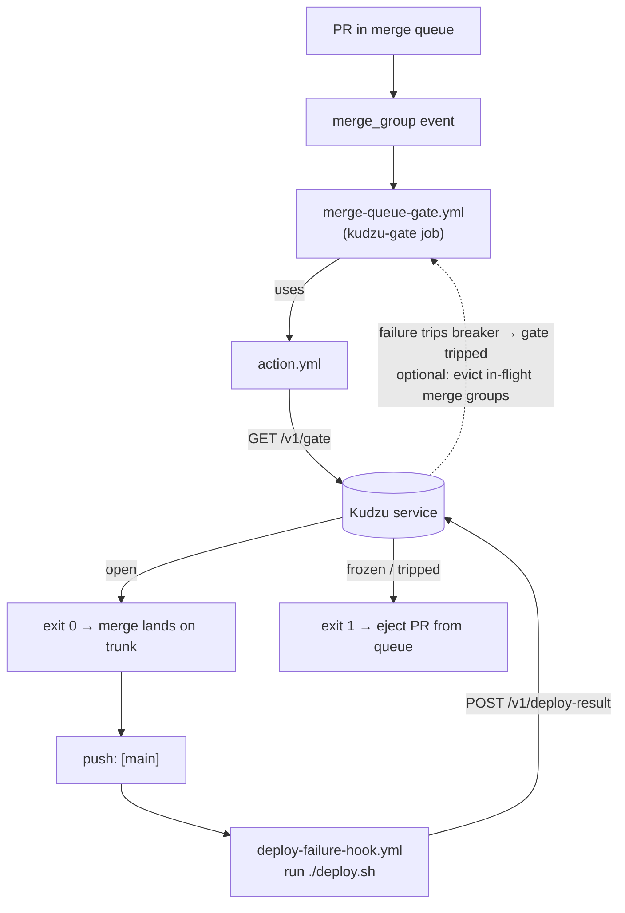

# Kudzu — GitHub Workflows

Kudzu integrates with a consumer repo through **two touch points**, plus the
composite action that backs the first:

| Piece | File | Direction | Triggered by | What it does |
|---|---|---|---|---|
| Composite action | [`github/action.yml`](../github/action.yml) | **read** | (used by the gate workflow) | Curls `GET /v1/gate`, exits 0/1 on `.allowed` |
| Merge-queue gate | [`github/examples/merge-queue-gate.yml`](../github/examples/merge-queue-gate.yml) | **read** | `merge_group` | Required check that ejects PRs when the gate isn't open |
| Deploy-result hook | [`github/examples/deploy-failure-hook.yml`](../github/examples/deploy-failure-hook.yml) | **write** | `push` to trunk | Reports deploy success/failure to the circuit breaker |

The two examples are **templates to copy into a consumer repo** — they are not
run from this repository. The merge-queue gate is the *enforcement* side; the
deploy-result hook is the *feedback* side that can trip the gate.

## How the two halves fit together



The loop: a failed deploy reported by the **hook** trips the breaker, which makes
the next **gate** check fail and eject queued PRs — so a broken trunk stops
further merges automatically until someone runs `POST /v1/gate/unfreeze`.

---

## 1. Composite action — `github/action.yml`

The reusable building block the gate workflow calls. It is published from this
repo and referenced as `cuotos/kudzu/github@v1`.

**Inputs:**

| Input | Required | Default | Notes |
|---|---|---|---|
| `url` | yes | – | Base URL of the Kudzu service |
| `service` | no | repo name (`github.event.repository.name`) | gate scope |
| `env` | no | `production` | gate scope |
| `token` | no | `""` | bearer token; only needed if `KUDZU_REQUIRE_READ_AUTH` is on |

**Behaviour:** `curl -fsS` to `GET {url}/v1/gate?service=&env=`, parse `.allowed`
with `jq`.
- `allowed == true` → prints `✅ … proceeding` and `exit 0`.
- otherwise → emits a GitHub `::error::` annotation with `.state` and `.reason`
  and `exit 1`.

Because the check fails closed (`set -euo pipefail`, `curl -f`), a Kudzu outage
or a non-2xx response also fails the job — deploys block rather than slip through
unverified.

## 2. Merge-queue gate — `examples/merge-queue-gate.yml`

The *enforcement* side. Copy into the consumer repo as
`.github/workflows/merge-queue-gate.yml`.

```yaml
name: Merge Queue Gate
on:
  merge_group: {}
jobs:
  kudzu-gate:
    runs-on: ubuntu-latest
    steps:
      - name: Check Kudzu deployment gate
        uses: cuotos/kudzu/github@v1
        with:
          url: ${{ vars.KUDZU_URL }}
          service: ${{ github.event.repository.name }}
          env: production
          token: ${{ secrets.KUDZU_TOKEN }}   # only if read auth is enabled
```

- **Trigger:** `merge_group` — fires only while GitHub is testing a candidate
  merge group in the queue (not on regular pushes/PRs).
- **The critical setup step:** mark this job a **required status check** on the
  branch ruleset that has the merge queue enabled. The required check name must
  equal the job display ("Kudzu Gate"). Without that, the workflow runs but its
  result is advisory and nothing gets ejected.
- When the gate isn't open, the action exits non-zero → the required check fails
  → GitHub **ejects** the PR from the merge queue.

## 3. Deploy-result hook — `examples/deploy-failure-hook.yml`

The *feedback* side. A snippet to add to your real production deploy workflow
(the one that runs after a merge lands on trunk).

```yaml
name: Deploy
on:
  push:
    branches: [main]
jobs:
  deploy:
    runs-on: ubuntu-latest
    env:
      KUDZU_URL:   ${{ vars.KUDZU_URL }}
      KUDZU_TOKEN: ${{ secrets.KUDZU_TOKEN }}
      SERVICE:     ${{ github.event.repository.name }}
    steps:
      - uses: actions/checkout@v4
      - name: Deploy to production
        run: ./deploy.sh           # your real deploy step
      - name: Report deploy result to Kudzu
        if: always()               # report on success AND failure
        run: |
          status=$([ "${{ job.status }}" = "success" ] && echo success || echo failed)
          curl -fsS -X POST "${KUDZU_URL}/v1/deploy-result" \
            -H "Authorization: Bearer ${KUDZU_TOKEN}" \
            -H 'content-type: application/json' \
            -d "$(jq -nc … '{service, env:"production", status, repo, base, sha, run_url}')"
```

- **Trigger:** `push` to the trunk branch (`main`) — i.e. right after a merge.
- **`if: always()`** on the report step is essential: the result must post even
  when `./deploy.sh` fails (that's the case the breaker exists for). `job.status`
  is read to derive `success` vs `failed`.
- **Payload** maps GitHub context onto the `POST /v1/deploy-result` body:
  `service`, `env`, `status`, `repo` (`$GITHUB_REPOSITORY`, used for eviction),
  `base` (`$GITHUB_REF_NAME`, the queue base branch), `sha`, and `run_url`.
- A `failed` result increments the breaker's consecutive-failure counter; at
  `BREAKER_FAILURE_THRESHOLD` (default 1) the gate trips. If a GitHub App is
  configured on the Kudzu side, the trip also evicts in-flight
  `gh-readonly-queue/<base>/*` merge groups immediately; otherwise the next gate
  check (step 2) is the backstop. A `success` resets the counter.
- This step **writes**, so `KUDZU_TOKEN` (a token from `KUDZU_WRITE_TOKENS`) is
  always required here, regardless of the read-auth setting.

---

## Prerequisites & wiring checklist

In the **consumer repo**:

1. Enable the **merge queue** on the trunk branch ruleset.
2. Add `merge-queue-gate.yml` and make its job a **required** status check on
   that ruleset.
3. Add the deploy-result report step to your deploy workflow.
4. Set repo **variable** `KUDZU_URL`, and **secret** `KUDZU_TOKEN` (always needed
   for the deploy hook's write; needed for the gate read only if
   `KUDZU_REQUIRE_READ_AUTH` is enabled).

On the **Kudzu service** side (see [`README.md`](../README.md) for the full env
table):

- `KUDZU_WRITE_TOKENS` must include the token used by the deploy hook.
- `REQUIRED_CHECK_CONTEXT` must equal the required-check name if you rely on
  proactive eviction (the commit-status context Kudzu posts when evicting).
- Optionally configure a GitHub App (`GITHUB_APP_*`) to enable proactive
  merge-group eviction on a trip.

## Token & scope summary

| Workflow | Calls | HTTP verb | Token needed? |
|---|---|---|---|
| `merge-queue-gate.yml` | `GET /v1/gate` | read | only if `KUDZU_REQUIRE_READ_AUTH=true` |
| `deploy-failure-hook.yml` | `POST /v1/deploy-result` | write | **always** (must be in `KUDZU_WRITE_TOKENS`) |
</content>
